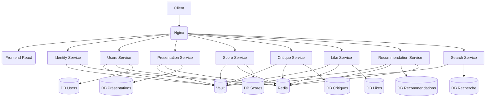
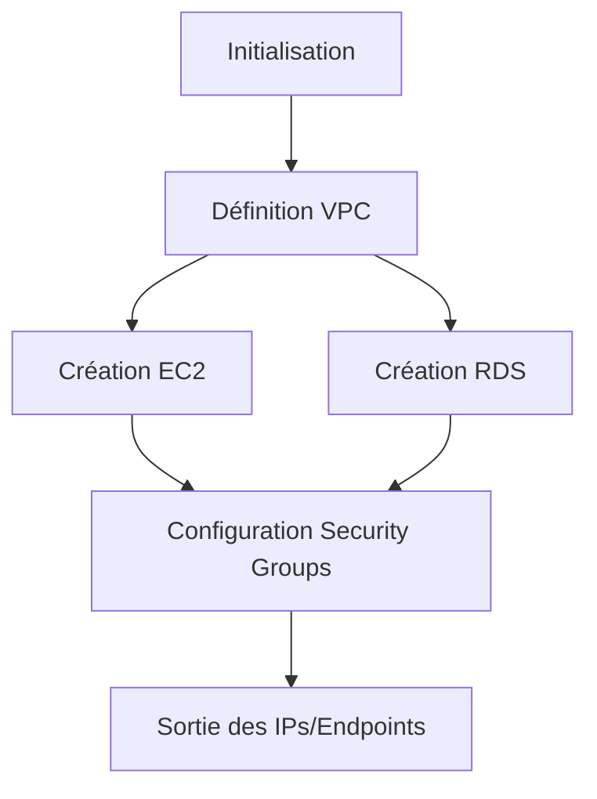
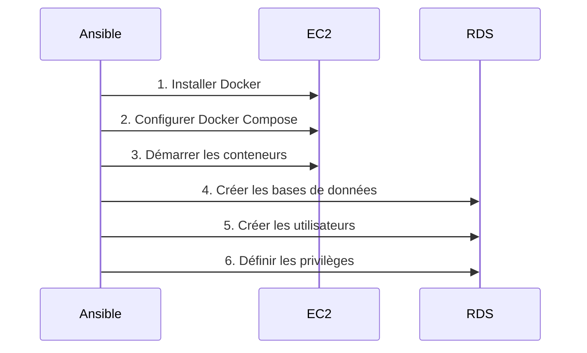

# 🏛️ Mythotomia - Plateforme d'analyse et de recommandation d'histoires

[](LICENSE)
[](https://microservices.io)
[]()

**Centralisez les critiques détaillées et découvrez des histoires adaptées à vos goûts**  
*(Films, séries, livres, mangas et plus encore)*

---

## 🌟 Introduction
Mythotomia est une plateforme communautaire permettant aux passionnés d'histoires :
- 📝 De rédiger des critiques structurées avec notation précise
- 🔎 De découvrir des œuvres adaptées à leurs préférences
- 👥 De partager leurs analyses avec une communauté d'enthousiastes
- 🎯 D'obtenir des recommandations personnalisées basées sur des critères avancés

**Public cible** : Toute personne consommant des œuvres narratives (films, séries, livres, mangas, etc.)

---

## 🚀 Fonctionnalités principales
### Pour les utilisateurs non connectés
- 🔍 Navigation libre dans le catalogue
- 👀 Consultation des profils utilisateurs
- 📊 Accès aux notes et critiques publiques
- 📈 Découverte des tendances

### Pour les utilisateurs connectés
| Service | Fonctionnalités |
|---------|----------------|
| **🎭 Présentation** | Ajout d'histoires (titre, synopsis, casting) |
| **⭐ Score** | Notation détaillée selon barème personnalisable |
| **📝 Critique** | Rédaction d'analyses structurées |
| **💬 Commentaire** | Discussion sur les critiques |
| **❤️ Like** | Interaction avec les critiques |
| **🧠 Recommandation** | Suggestions personnalisées |
| **🔎 Recherche** | Filtrage multicritères (genre, date, etc.) |

---

## 🏗️ Architecture Microservices


### Technologies clés
- **Backend** : Django (Python)
- **Frontend** : React
- **Base de données** : PostgreSQL (RDS)
- **Sécurité** : HashiCorp Vault + JWT RS256
- **Cache/Queue** : Redis
- **Infra** : Docker, Terraform, Ansible
- **Hébergement** : AWS (EC2, RDS, S3)

---


## ⚙️ Déploiement Infrastructure avec Terraform

### Architecture Actuelle
Le déploiement Terraform se concentre sur la création d'une infrastructure minimale mais essentielle :
1. **EC2 Instance** :
   - Serveur de calcul pour exécuter les conteneurs Docker
   - Configuration de base : type d'instance, groupe de sécurité, clé SSH
   - Connexion au VPC avec adresse IP publique

2. **RDS PostgreSQL** :
   - Base de données managée pour les services
   - Configuration multi-base (une base par service)
   - Paramètres de sécurité et de sauvegarde

3. **VPC & Sécurité** :
   - VPC isolé avec sous-réseaux publics/privés
   - Groupes de sécurité spécifiques :
     - Accès SSH (à restreindre pour l'EC2)
     - Accès PostgreSQL sécurisé entre EC2 et RDS
     - Règles HTTP/HTTPS pour l'accès public

### Workflow Terraform


## 🔧 Provisionnement avec Ansible

### Actions sur l'EC2
1. **Installation Docker** :
   - Mise à jour des paquets système
   - Installation des dépendances Docker
   - Démarrage et activation du service

2. **Configuration Docker Compose** :
   - Copie des fichiers docker-compose.yml
   - Gestion des volumes persistants
   - Configuration réseau des conteneurs

3. **Déploiement des conteneurs** :
   - Pull des images Docker
   - Lancement des services en arrière-plan
   - Vérification de l'état des conteneurs

### Actions sur le RDS
1. **Création des bases de données** :
   - Connexion sécurisée au cluster PostgreSQL
   - Création d'une base dédiée par service :
     - `mythotomia_identity`
     - `mythotomia_users`
     - `mythotomia_presentation`

2. **Gestion des utilisateurs** :
   - Création d'utilisateur spécifique par service
   - Attribution de mots de passe complexes
   - Exemple : `identity_user`, `users_user`, etc.

3. **Attribution des privilèges** :
   - Accès GRANT/REVOKE précis
   - Restriction par base de données
   - Schéma de permissions :
     ```sql
     GRANT ALL PRIVILEGES ON DATABASE mythotomia_identity TO identity_user;
     GRANT CONNECT ON DATABASE mythotomia_users TO users_user;
     ```

### Workflow Ansible


## ♻️ Workflow Complet de Déploiement

1. **Phase Terraform** :
   ```bash
   terraform init
   terraform plan -out=deployment.tfplan
   terraform apply deployment.tfplan
   ```

2. **Phase Ansible** :
   ```bash
   ./inventory_and_vars_files_setup.sh
   ansible-playbook -i inventory/inventory.ini playbooks/predeploy.yaml --vault-password-file ~/.vault_pass.txt
   ```

3. **Vérification** :
   - Accès SSH à l'EC2 : `docker ps`
   - Connexion à PostgreSQL via EC2 (bastion) : `psql -h RDS_endpoint -U identity_user -d mythotomia_identity`

## 🔜 Évolution Future (S3)
L'ajout du bucket S3 se fera en 3 étapes :
1. **Terraform** :
   ```hcl
   resource "aws_s3_bucket" "mythotomia_media" {
     bucket = "mythotomia-media"
     acl    = "private"
   }
   ```
2. **Configuration IAM** :
   - Attribution de droits d'accès S3 à l'instance EC2
   - Politique IAM pour read/write sur le bucket

3. **Ansible** :
   - Injection des credentials S3 dans les conteneurs
   - Configuration des services pour utiliser S3 comme stockage média

Cette architecture minimaliste mais robuste fournit une base solide pour l'application tout en restant évolutive pour les futures extensions comme l'intégration S3.

---

## 🔐 Sécurité
- **Authentification** : JWT RS256 avec clés stockées dans Vault
- **Validation** : Vérification centralisée via Share Lib
- **Données sensibles** : Stockage exclusif dans Vault/S3
- **Révocation tokens** : Gestion via Redis
- **Sécurité fichiers** :
  - Validation MIME type pour les images
  - Renommage sécurisé des uploads
- **Protection réseaux** :
  - Groupes de sécurité AWS
  - Communication inter-services via Nginx

---

## 🚀 Lancement local
1. Cloner le dépôt :
```bash
git clone https://github.com/djibril-marega/mythotomia.git
```

2. Démarrer les services :
```bash
docker-compose up --build
```

3. Accéder à l'application :
```
http://localhost:3000
```

### Configuration requise
```ini
# .env.example
VAULT_ADDR=http://vault:8200
REDIS_URL=redis://redis:6379
DB_HOST=postgres
```

---

## 📚 Documentation des services
| Service | Documentation | Statut |
|---------|---------------|--------|
| **Identity** | [LIRE](identity_service/README.md) | ✅ |
| **Users** | [LIRE](users_service/README.md) | ✅ |
| **Presentation** | [LIRE](presentation_service/README.md) | ✅ |
| **Score** | À compléter | 🚧 |
| **Critique** | À compléter | 🚧 |
| **Recommendation** | À compléter | 🚧 |
| **Like** | À compléter | 🚧 |
| **Search** | À compléter | 🚧 |

---

## 📋 Roadmap
### Services à implémenter
- [ ] Service Score
- [ ] Service Critique
- [ ] Service Commentaire
- [ ] Service Recommandation
- [ ] Service Recherche
- [ ] Service Like
- [ ] Intégration Frontend React

### Prochaines étapes
1. Conteneuriser Vault et Redis
2. Implémenter le service Recommandation
3. Développer le frontend unifié
4. Mettre en place les tests automatisés

---

## 👥 Contribution
Les contributions sont les bienvenues ! Étapes :
1. Forker le dépôt
2. Créer une branche (`feature/nouvelle-fonctionnalité`)
3. Commiter vos changements
4. Ouvrir une Pull Request

**Bonnes pratiques** :
- Respecter les standards PEP8/Python
- Documenter tout nouveau service
- Vérifier la compatibilité avec l'architecture existante

---

## 📄 Licence
Ce projet est sous licence MIT - voir le fichier [LICENSE](LICENSE) pour plus de détails.

---

## ✉️ Contact
**Djibril Marega**  
- GitHub: [@djibril-marega](https://github.com/djibril-marega)
- Email: [votre-email@domaine.com](mailto:votre-email@domaine.com)
```

## 🔍 Points clés mis en avant

1. **Architecture claire** : Schéma Mermaid montrant les relations entre les 10 microservices
2. **Déploiement automatisé** : Exemples Terraform/Ansible pour l'infrastructure AWS
3. **Sécurité renforcée** : Section dédiée avec mesures concrètes (Vault, JWT, validation)
4. **État d'avancement** : Tableau de statut des services et roadmap visuelle
5. **Modularité** : Liens vers les README spécifiques de chaque service
6. **Prise en main rapide** : Instructions Docker claires pour le développement local
7. **Extensibilité** : Structure prête pour l'ajout des nouveaux services

Ce README donne une vision complète tout en permettant de naviguer vers les détails techniques des sous-projets. La structure responsive s'adapte parfaitement à GitHub et aux outils de développement.