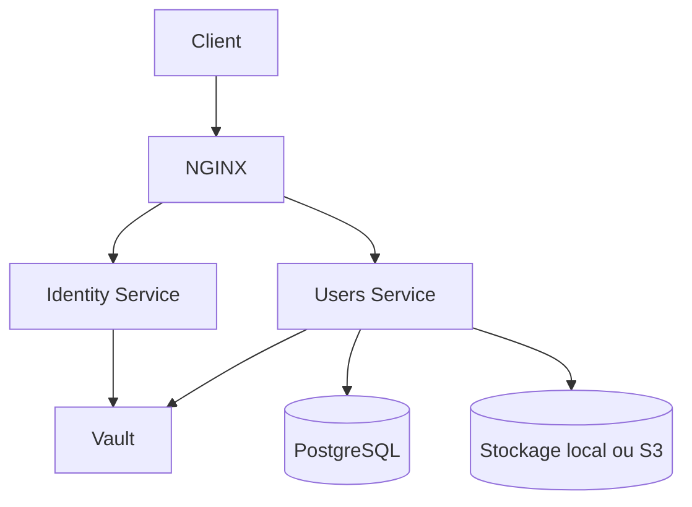

# 🛡️ Identity Service – Mythotomia

Service Django de gestion des comptes utilisateurs avec authentification JWT (RS256), intégration Vault, et envoi sécurisé de mails.

---

## ✨ Résumé

`identity_service` est un microservice d'identité qui :

- Authentifie les utilisateurs via JWT RS256
- Permet l’inscription, la connexion, la déconnexion, la modification et la suppression de compte
- Vérifie les adresses e-mail avec un code à 6 chiffres
- Notifie les utilisateurs par mail après chaque action critique
- Supprime automatiquement les comptes désactivés après un délai de 30 jours
- Utilise Vault pour la gestion des secrets et la génération des clés RSA **sans jamais exposer la clé privée**

---

## 🧭 Position dans l'architecture



---

## ⚙️ Fonctionnalités principales

- 🔐 Authentification JWT signée avec RS256 (clé privée stockée dans Vault)
- 📧 Envoi d’e-mails via AWS SES (SMTP ou IAM)
- ✅ Vérification d’e-mail à l'inscription ou après modification
- 🗑️ Suppression différée des comptes (désactivation → suppression après 30 jours)
- 🔄 Mise à jour sécurisée de l'email, du mot de passe ou du nom d'utilisateur
- 📬 Notification par mail pour chaque action importante
- 🕒 Tâche périodique Celery (beat) pour supprimer les comptes expirés

---

## 🛣️ Routes disponibles

### 🔐 Authentification & Sécurité (`auth_app.urls`)

| Méthode | URL                                                          | Description                                       | Authentification |
| ------: | ------------------------------------------------------------ | ------------------------------------------------- | ---------------- |
|    POST | `/authentification/signup/`                                  | Inscription d'un nouvel utilisateur               | Non              |
|    POST | `/authentification/login/`                                   | Connexion de l'utilisateur                        | Non              |
|     GET | `/authentification/logout/`                                  | Déconnexion de l'utilisateur                      | Oui              |
|    POST | `/authentification/verify-email/`                            | Vérification de l'email                           | Oui              |
|    POST | `/authentification/reset-password/`                          | Envoi du lien de réinitialisation de mot de passe | Non              |
|     GET | `/authentification/reset-password/done/`                     | Confirmation d'envoi d'email                      | Oui              |
|    POST | `/authentification/reset-password-confirm/<uidb64>/<token>/` | Validation du token de réinitialisation           | Non              |
|     GET | `/authentification/reset-password-complete/`                 | Confirmation de la réinitialisation               | Non              |

### ⚙️ Paramètres de compte (`settings_app.urls`)

| Méthode | URL                                                   | Description                                             | Authentification |
| ------: | ----------------------------------------------------- | ------------------------------------------------------- | ---------------- |
|     GET | `/settings/security/`                                 | Page de sécurité générale                               | Oui              |
|    POST | `/settings/security/password_change/`                 | Modifier son mot de passe                               | Oui              |
|     GET | `/settings/security/password_change/done/`            | Confirmation de changement de mot de passe              | Oui              |
|    POST | `/settings/security/change-email/verify-password/`    | Vérifier mot de passe pour changer l'email              | Oui              |
|    POST | `/settings/security/change-email/`                    | Soumettre un nouvel email                               | Oui              |
|    POST | `/settings/security/change-email/confirm-new-email/`  | Confirmer le nouvel email                               | Oui              |
|    POST | `/settings/security/change-username/verify-password/` | Vérifier mot de passe pour changer le nom d'utilisateur | Oui              |
|    POST | `/settings/security/change-username/`                 | Soumettre un nouveau nom d'utilisateur                  | Oui              |
|    POST | `/settings/security/delete-account/confirm/`          | Confirmer la suppression de compte                      | Oui              |
|    POST | `/settings/security/delete-account/`                  | Supprimer (ou désactiver) le compte utilisateur         | Oui              |

---


## ✅ Étapes réalisées

### 0. Mettre en place l'environnement Docker

- Installation de Docker Desktop sur Windows
- Création d'un `docker-compose.yml` à la racine du projet (`mythotomia`)
- Tous les services (`identity`, `users`, `reverse_proxy`) ont un `Dockerfile` dédié

### 1. Paramétrage de PostgreSQL

- Création de deux bases : `mythotomia_identity` et `mythotomia_users`
- Activation des connexions extérieures :
  - `listen_addresses = "*"` dans `postgresql.conf`
  - Règle `host all all 0.0.0.0/0 md5` dans `pg_hba.conf`
  - Ouverture du port 5432 (entrées autorisées sur Windows)
  - Connexions testées depuis une autre machine

### 2. Paramétrage de Redis

- Configuration du fichier de configuration de Redis (installé sur une VM Debian) afin de permettre les connexions extérieures
- Ouverture du port Redis dans les règles du pare-feu de la machine pour autoriser l'accès distant

### 3. Paramétrage de Vault

- Lancement du serveur Vault avec accès externe :
  ```bash
  vault server -dev -dev-listen-address="0.0.0.0:8200"
  ```
- Injection des secrets nécessaires au service `identity_service`

### 4. Conteneurisation de `identity_service`

- Build de l’image :
  ```bash
  docker build -t identity_service .
  ```
- Lancement avec les variables d’environnement :
  ```bash
  docker run --env-file .env -p 8000:8000 identity_service
  ```

---

## 🔐 Secrets requis dans Vault

```
# SMTP (pour les e-mails)
SMTP_USERNAME
SMTP_PASSWORD
SMTP_EMAIL

# IAM (AWS SES)
ACCESS_KEY_ID
SECRET_ACCESS_KEY

# PostgreSQL
DB_NAME
DB_USER
DB_PASSWORD
DB_HOST
DB_PORT

# Redis
REDIS_PASSWORD
REDIS_SRV_IP

# Django
DJANGO_SECRET_KEY
DJANGO_ALLOWED_HOSTS
```

---

## 🔁 Lancement local

Utilise `honcho` pour lancer les services :

```bash
honcho start
```

Procfile (exemples) :

**Windows**
```
web: python manage.py runserver
worker: celery -A identity_service worker --pool=solo --loglevel=info
beat: celery -A identity_service beat --loglevel=info
```

**Linux**
```
web: python manage.py runserver
worker: celery -A identity_service worker --loglevel=info
beat: celery -A identity_service beat --loglevel=info
```

---

## 📂 Variables d’environnement

Extrait de `.env.example` :
```env
DEBUG=true

VAULT_ADDR=http://127.0.0.1:8200
VAULT_TOKEN=hvs.xxxxxxxx
MOUNT_POINT=service-identity

SECRET_DB_PATH=db
SECRET_AWS_IAM_PATH=aws/ses/iam
SECRET_AWS_SMTP_PATH=aws/ses/smtp
SECRET_REDIS_PATH=redis
SECRET_DJANGO_PATH=django

SECRET_RSA_KEY_NAME=jwt-rsa-key
```

🛑 **Ne versionnez jamais votre token Vault !**

---

## 🐳 Docker

```bash
docker build -t identity-service .
docker run -d   --name identity   -p 8000:8000   -v /etc/secrets/vault_token:/run/secrets/vault_token:ro   -e VAULT_TOKEN_FILE=/run/secrets/vault_token   identity-service
```

---

## ⏱️ Tâches planifiées

Configurer les tâches dans l’admin Django (`django-celery-beat`).

---

## 📦 Technologies utilisées

- Python 3.11
- Django 5.2
- Celery + Beat
- Redis
- Vault (HashiCorp)
- AWS SES (SMTP/IAM)
- JWT (RS256)
- Honcho
- Docker

---

## 🔧 Services requis avant lancement

- Vault
- Redis
- PostgreSQL

Configurer l’accès dans `.env` (voir `.env.example`).

---

## 🛠️ À faire

- [ ] Ajouter des tests automatisés
- [ ] Ajouter un service `user_profile` si séparation prévue
- [ ] Blacklister les JWT à la déconnexion
- [ ] Ajouter un UUID utilisateur comme identifiant unique dans les tokens

---

## 📁 Projet parent : [Mythotomia](https://github.com/djibril-marega/mythotomia)

Ce service fait partie du projet global Mythotomia.

---

## 🛑 Sécurité

- 🔐 Clé privée RSA stockée uniquement dans Vault
- 🧊 Aucun secret sensible stocké dans l’image Docker
- 🔄 Récupération dynamique des secrets 

---

## ✍️ Auteur

Marega Djibril  
Projet personnel  
[GitHub : @djibril-marega](https://github.com/djibril-marega)