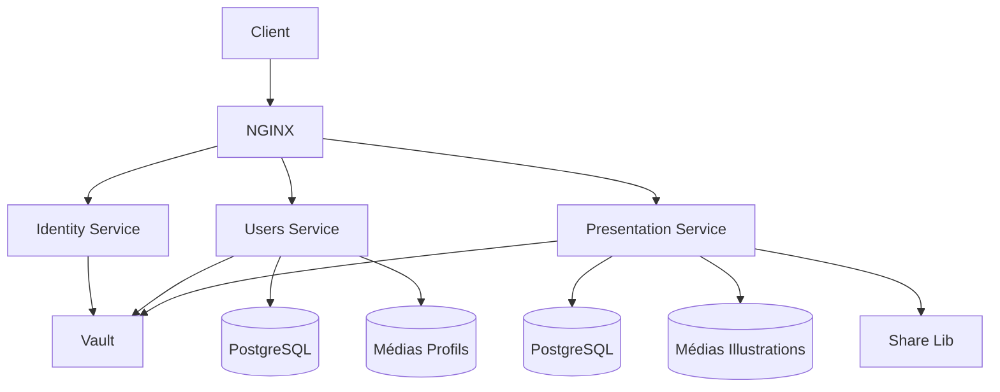
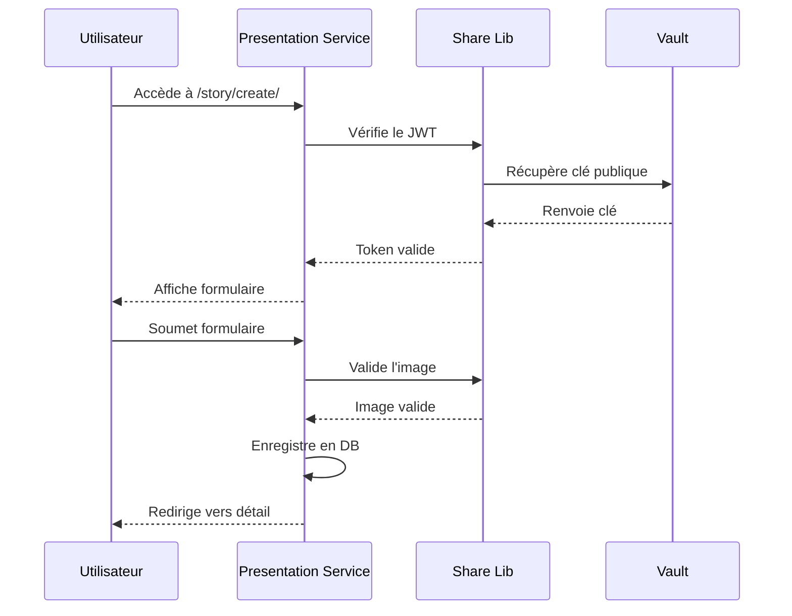

# 🎬 Presentation Service – Mythotomia

Service Django permettant aux utilisateurs de créer et de partager des présentations d'histoires (films, séries, livres) avec des illustrations.

---

## ✨ Résumé

`presentation_service` est un microservice qui permet aux utilisateurs authentifiés de :
- Créer des présentations d'histoires complètes (titre, auteur, synopsis, casting, etc.)
- Télécharger des illustrations pour leurs histoires
- Consulter les présentations créées par d'autres utilisateurs
- Accéder aux profils des créateurs d'histoires via une intégration avec le service utilisateurs

---

## 🧭 Position dans l'architecture



---

## ⚙️ Fonctionnalités principales

- 🖋️ Création de présentations d'histoires avec :
  - Titre, sous-titre, auteur
  - Genre, date de sortie, pays d'origine
  - Casting, synopsis
  - Illustrations
- 🖼️ **Validation des images via Share Lib** :
  - Vérification du type MIME (PNG/JPG uniquement)
  - Protection contre les fichiers malveillants
- 🔍 Consultation publique des présentations
- 👤 Intégration transparente avec le service utilisateurs :
  - Affichage des photos de profil
  - Redirection vers les pages de profil
- 🔐 **Validation JWT via Share Lib** :
  - Vérification des tokens via Vault
  - Gestion centralisée de la sécurité

---

## 🛣️ Routes disponibles

| Méthode | URL                                 | Description                                      | Authentification |
|--------:|-------------------------------------|--------------------------------------------------|------------------|
|    GET  | `/presentation/story/create/`       | Formulaire de création d'histoire                | Oui (JWT)       |
|   POST  | `/presentation/story/create/`       | Soumission du formulaire de création             | Oui (JWT)       |
|    GET  | `/presentation/story/<int:id>/`     | Détail d'une présentation d'histoire             | Non             |

---

## 🔧 Intégration Share Lib

### Validation d'images
```python
from share_lib.file_validation import validate_image_mimetype

# Dans le formulaire
def clean_illustrations(self):
    image = self.cleaned_data.get('illustrations')
    if image:
        validate_image_mimetype(image)
    return image
```

### Validation JWT
```python
from share_lib.auth import verify_jwt_ps256_with_vault_key, validate_payload

# Dans la vue
token = request.COOKIES.get("access_token")
if token:
    client = connect_to_vault(VAULT_ADDR, VAULT_TOKEN)
    payload = verify_jwt_ps256_with_vault_key(client, token, keyName)
    if payload and validate_payload(payload):
        # Utilisateur authentifié
```

---

## 🧠 Modèle `PresentationStory`

| Champ                | Type         | Description                                | Validation              |
|----------------------|--------------|--------------------------------------------|-------------------------|
| `external_user_id`   | IntegerField | ID utilisateur (service Identity)          |                         |
| `email`              | EmailField   | Email du créateur                          |                         |
| `username`           | CharField    | Nom d'utilisateur du créateur              |                         |
| `illustrations`      | ImageField   | Illustration principale                    | `validate_image_mimetype` |
| `title`              | CharField    | Titre de l'histoire                        |                         |
| `subtitle`           | CharField    | Sous-titre optionnel                       |                         |
| `author`             | CharField    | Auteur de l'œuvre                          |                         |
| `genre`              | CharField    | Genre principal                             |                         |
| `release_date`       | DateField    | Date de sortie                             |                         |
| `country_of_origin`  | CharField    | Pays d'origine                             |                         |
| `cast`               | CharField    | Acteurs principaux                         |                         |
| `synopsis`           | TextField    | Synopsis détaillé                          |                         |

---

## 🔐 Sécurité renforcée

- **Validation centralisée** :
  - Toutes les validations critiques sont gérées par Share Lib
  - Mise à jour unique pour tous les services
- **Protection JWT** :
  - Vérification RS256 avec clés stockées dans Vault
  - Aucun secret dans le code source
- **Validation de fichiers** :
  - Seuls les PNG/JPG autorisés
  - Protection contre les extensions malveillantes
- **Normalisation de noms de fichiers** :
  - Conversion en ASCII
  - Suppression des caractères spéciaux

---

## 🐳 Intégration Docker

```yaml
services:
  presentation:
    build:
      context: ./presentation_service
    container_name: presentation
    env_file: 
      - ./presentation_service/.env
    volumes:
      - presentation_static:/app/staticfiles
      - ./presentation_service/media/illustrations:/app/media/illustrations
    expose:
      - "8000"
    networks:
      - backend
```

---

## 🔐 Secrets requis dans Vault

```
# PostgreSQL
DB_NAME
DB_USER
DB_PASSWORD
DB_HOST
DB_PORT

# Django
DJANGO_SECRET_KEY
DJANGO_ALLOWED_HOSTS

# Service Users
USERS_SERVICE_URL
```

---

## ⚙️ Workflow de création



---

## 📋 Variables d'environnement

`.env.example` :
```env
# Vault
VAULT_ADDR=http://vault:8200
VAULT_TOKEN=hvs.xxxxxxxx
MOUNT_POINT=service-presentation

# PostgreSQL
DB_NAME=mythotomia_presentation
DB_USER=presentation_user
DB_PASSWORD=strongpassword
DB_HOST=postgres
DB_PORT=5432

# Django
DEBUG=false
ALLOWED_HOSTS=localhost,presentation,127.0.0.1

# Service Users
USERS_SERVICE_URL=http://users:8000
```

---

## 📦 Dépendances clés

```python
# requirements.txt
Django==5.2
psycopg2-binary
requests
django-environ
share-lib @ git+https://github.com/djibril-marega/mythotomia.git@main#subdirectory=share_lib
```

---

## 🚀 Déploiement local

1. Installer Share Lib :
```bash
pip install "git+https://github.com/djibril-marega/mythotomia.git@main#subdirectory=share_lib"
```

2. Démarrer les services :
```bash
docker-compose up -d postgres users identity vault
```

3. Lancer le service :
```bash
python manage.py runserver
```

---

## 🌟 Avantages de l'architecture

1. **Sécurité centralisée** :
   - Validation JWT et fichiers via Share Lib
   - Mises à jour de sécurité propagées à tous les services
   
2. **Maintenabilité** :
   - Code métier simplifié dans le service
   - Logique critique testée une fois dans Share Lib
   
3. **Cohérence** :
   - Mêmes règles de validation dans tous les services
   - Expérience utilisateur uniforme

---

## ✍️ Auteur

Marega Djibril  
Projet personnel  
[GitHub : @djibril-marega](https://github.com/djibril-marega)

---

## 🔗 Lien vers le projet parent

Ce service fait partie du projet global [Mythotomia](https://github.com/djibril-marega/mythotomia).

