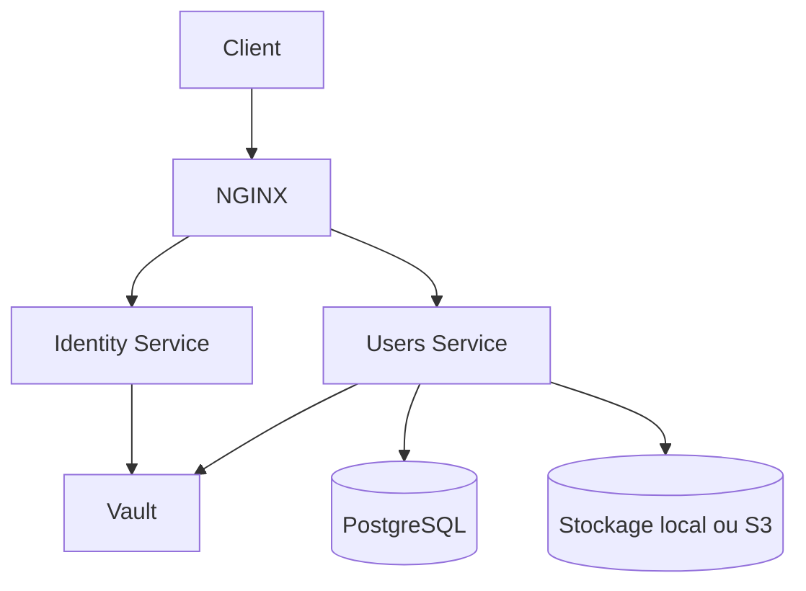

# 🧑‍💼 `users_service` – Gestion des profils utilisateurs

## ✨ Objectif

Ce service gère les profils utilisateurs dans l'application **Mythotomia** : création, modification et consultation, avec une attention forte à la **sécurité**, à la **protection des données** et à l'**expérience utilisateur**.

---

## 🧭 Position dans l'architecture



- Le `users_service` est **protégé par Nginx**.
- Les requêtes passent par un **token JWT** signé et vérifié.
- La clé RSA est fournie par **Vault**.
- Les images sont stockées en **local ou via un objet storage (S3/MinIO)**.

---

## 🔧 Fonctionnalités

- 🔒 **Sécurité intégrée** :
  - Un utilisateur ne peut modifier que **son propre profil**.
  - Les données sensibles (email, date de naissance) sont masquées en vue publique.
  - Le service **valide les fichiers envoyés** (type MIME, poids).
- 👤 **Édition de profil** :
  - Nom, prénom, bio, date de naissance
  - Photo de profil
  - Bannière
- 🔎 **Consultation de profil** :
  - Vue complète (propriétaire)
  - Vue publique (autres utilisateurs)
- 🌐 **API REST** :
  - Compatible avec applications mobiles ou frontend SPA.

---

## 🔐 Sécurité

- **Authentification via JWT signé en RS256**
- **Vérification côté gateway** (`identity_service`)
- **Révocation/expiration gérées via Vault**
- **Validation des fichiers image via la bibliothèque partagée** pour garantir la conformité de l’extension de l’image uploadée.
- **Médias** renommés `{user_id}__{filename}` pour éviter les collisions
- **Suppression automatique** des anciens fichiers

---

## 🛣️ Routes disponibles

| Méthode | URL                        | Description                             | Authentification |
|--------:|----------------------------|-----------------------------------------|------------------|
| GET     | `/users/<username>/`       | Voir un profil (pub./privé)             | Oui              |
| GET     | `/me/edit/`                | Voir le formulaire d’édition            | Oui              |
| POST    | `/me/edit/`                | Modifier son profil                     | Oui              |

---

## 🧠 Modèle `UserProfile`

| Champ             | Type         | Règle de validation                     |
|-------------------|--------------|-----------------------------------------|
| `external_user_id`| CharField    | Récupéré depuis le JWT (`sub`)          |
| `email`           | EmailField   | Format email                            |
| `username`        | CharField    | Unique                                  |
| `first_name`      | CharField    | Lettres/accents uniquement              |
| `last_name`       | CharField    | Lettres/accents uniquement              |
| `bio`             | TextField    | ≤ 1000 caractères                       |
| `birth_date`      | DateField    | Doit être une date passée               |
| `profile_photo`   | ImageField   | Format image valide                     |
| `banner`          | ImageField   | Format image valide                     |

---

## ⚙️ Dépendances

```txt
Django==5.2.4
djangorestframework==3.16.0
hvac==2.3.0
PyJWT==2.10.1
pillow==11.3.0
psycopg2-binary==2.9.10
python-decouple==3.8
share-lib @ git+https://github.com/djibril-marega/mythotomia.git@main#egg=share-lib&subdirectory=share_lib
```

---

## 📦 Dockerfile (extrait)

```dockerfile
FROM python:3.11-slim

WORKDIR /app

COPY requirements.txt .
RUN pip install --no-cache-dir -r requirements.txt

COPY . .

EXPOSE 8000
CMD ["python", "manage.py", "runserver", "0.0.0.0:8000"]
```

---

## 🧪 Exemple de requête POST `/me/edit/`

```http
POST /me/edit/ HTTP/1.1
Authorization: Bearer <jwt>
Content-Type: multipart/form-data

{
  "first_name": "Alice",
  "last_name": "Lemoine",
  "bio": "Je suis développeuse.",
  "birth_date": "1993-05-12",
  "profile_photo": [fichier],
  "banner": [fichier]
}
```

**Réponse :**

```http
HTTP/1.1 302 Found
Location: /users/alicelemoine/
```

---

## 🌱 À venir

- 📤 Intégration avec S3 ou MinIO
- 🕒 Historique des modifications
- ✅ Vérification de profil (badge)
- 📱 API REST complète (GET/PUT/DELETE)

---

## 📌 Bonnes pratiques mises en place

- Validation stricte des champs (regex, type, taille)
- Masquage conditionnel des données personnelles
- Fichiers utilisateurs protégés et nettoyés
- Token JWT validé côté Nginx/Identity puis extrait localement

---

## 📚 Mise à jour de la lib partagée

Pour mettre à jour `share-lib` dans l'image Docker :

```bash
pip install "git+https://github.com/djibril-marega/mythotomia.git@main#egg=share-lib&subdirectory=share_lib"
pip freeze > requirements.txt
```

---

## ✉️ Contact

Pour toute question ou contribution, merci de contacter [Djibril Marega](https://github.com/djibril-marega).